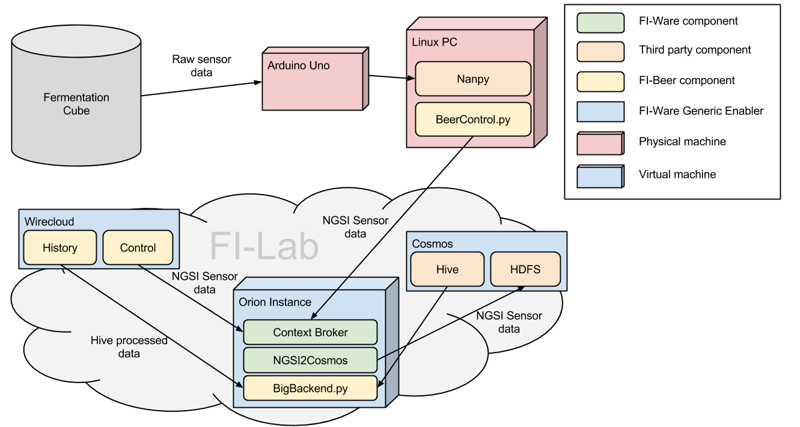

Fi-Beer
=======

# Overview
FI-Beer is a [FI-Ware](http://edu.fi-ware.eu/course/index.php) software prototype to manage the beer fermentation of a homebrewing process with a group of sensors controlled with a Debian Linux PC and an [Arduino One board](http://arduino.cc/en/Main/arduinoBoardUno). Below you can find a diagram of all the system components and a brief explanation of their functions. The following sections will detail how the components were connected and all the software and hardware installed, bottom-up.



FI-Beer makes use of several FI-Ware building blocks, all of them deployed in the FI-Lab testbed:
* [Context Broker](http://catalogue.fi-ware.eu/enablers/publishsubscribe-context-broker-orion-context-broker): a data concentrator for all the measures, manages subscriptions and data access. Needs some scripting in order to integrate it with Cosmos (NGSI2Cosmos script that can be found on the [FI-Ware Live Demo App](https://github.com/telefonicaid/fiware-livedemoapp) ).  
* [Wirecloud](http://catalogue.fi-ware.eu/enablers/application-mashup-wirecloud): Front End based on HTML5+JS widget composing, offers some libraries to integrate with the CB. 
* [Cosmos](http://catalogue.fi-ware.eu/enablers/bigdata-analysis-cosmos): Big Data platform to store and analyze measure data.

# Detailed description

## Fermentation instrumentation and hardware connection

In the first iteration of the prototype, the system will only manage one magnitude of the fermentation process: the temperature. Five [LM35 temperature sensors](http://www.ti.com/lit/ds/symlink/lm35.pdf) were connected to the fermentation cube to track its evolution. In order to enable the system to lower or raise the temperature, a device composed of peltier cells and fans was built around the cube (this part of the system is still under development).

All the sensors data pins were connected to the analogical data inputs of an Arduino One board, that was plugged to the Linux PC via USB. 

## Linux and NGSI Client

All the sensor reading is done in a Python script that reads the sensor data from the Arduino and sends it to the Context Broker using the [NGSI Protocol](http://forge.fi-ware.eu/plugins/mediawiki/wiki/fiware/index.php/OMA_NGSI_10). The Python-to-Arduino connection is created using [Nanpy](https://github.com/nanpy). 

### Step by step

#### Installing Nanpy

1. Download Nanpy from the Github account.

```
git clone git@github.com:nanpy/nanpy.git
```

2. From the root directory of nanpy, execute the installation script:

```
python setup.py install
```

3. Connect the Arduino board to the linux host.
4. Upload the firmware to the Arduino Uno board. You might need to execute this step again if the computer is rebooted or the Arduino disconnected (not exactly sure why, but it probably have to do with the device id). Export the following variable `BOARD=uno` and from the `firmware/Nanpy` folder execute:

```
make upload
```

If your Arduino is not a Uno, change the `BOARD` variable accordingly.

Now the board is ready to be used from Python.

#### Reading the sensors from the Python script

Arduino pins can be accessed from Python using the Nanpy library you just installed. In order to do so, first of all, you have to import the library:

```
from nanpy import Arduino
```

The Arduino class represents the basic I/O operations of the Arduino board. It contains methods to:

* Define the type of I/O of the pin: `Arduino.pinMode(pin, Arduino.INPUT)`
* Read from the Inputs: `Arduino.analogRead(pin)`
* Write to the outputs: `Arduino.digitalWrite(13, Arduino.HIGH)`

You can also change the device where the Nanpy expects the Arduino by using the `serial_manager` module:

```
serial_manager.connect('/dev/ttyACM0')
```

The library provides more advanced modules, but only the simplest Arduino access will be used in this prototype. When you are connecting your sensors to the pins, remember that only a restricted set of pins is capable of analog input.

The temperature sensor reading is defined in terms of voltage; the exact formula to convert from voltage readings to celsius degrees depends on the particular sensor model. You can find the one for the LM35 in the code.

The control loop is currently implemented as a simple infinite loop with sleep intervales betweeen iterations.

#### Developing the NGSI Client

The Context Broker, where the measures will be aggregated and distributed, listens for requests following the [NGSI protocol](http://technical.openmobilealliance.org/Technical/release_program/NGSI_v1_0.aspx). In order to communicate with this component, a NGSI client was developed. The NGSI protocol defines several resources and operations, but the client only use a very restricted set:

* Appending a new measure for a context. 
* Getting measures for a particular context (not currently in use in the prototype but expected).

The NGSI protocol is a REST protocol that accepts both XML and JSON payloads. In this case, all the communications were stablished using the `requests` HTTP library with JSON payloads (using the default `json` python library).  
 
## The Context Broker

The [Orion Context Broker](https://forge.fi-ware.eu/plugins/mediawiki/wiki/fiware/index.php/Publish/Subscribe_Broker_-_Orion_Context_Broker_-_User_and_Programmers_Guide#Query_Context_operation) was used as the central data node of the system. All the data of the sensors is sent to Orion who, in turn, send it to all its suscribers and can be queried from the frontend systems to get up-to-date information of any of the measures.

For the prototype, we used a dedicated cloud instance in [FI-Lab](http://lab.fi-ware.eu/), that has a preinstalled Context Broker service (the image name is `orion-psb-image-R3.2`). The service is disabled by default, so make sure you activate it with:

```
service context-broker start
```

before starting to use the broker. It should start listening on port 1026. Remember to open this port in the Security Group. The virtual machine also comes with its own MongoDB instance, that you can use to check the information currently stored in your broker.

NOTE: There is currently a bug in the Context Broker that ocasionally corrupts the executable file. It may be a good idea to copy the executable file to a safe place in order to restore it if there is any trouble with the service (your other option is to reinstall it if you notice any weird behavior). 

## Wirecloud Management Widget
The Front End of the system was designed as a series of widgets deployed in FI-Ware's Mashup Platform: [Wirecloud](http://conwet.fi.upm.es/wirecloud/). The widgets were deployed in the FI-Lab's marketplace and composed in a new workspace.

Two widgets were designed:
* Temperature control widget: that consumes data from the Context Broker, showing a graph of the cube with realtime information on the temperature, signaling what parts are too cool or too warm.
* Historical data widget: depicting the evolution of the temperature over the last minutes.

## Connection to Cosmos (HDFS and Hive)

In order to consume the historical data from the widgets, it has to be first stored somewhere. FI-Ware sensor data is stored in the HDFS system of its Big Data GE: [Cosmos](http://catalogue.fi-ware.eu/enablers/bigdata-analysis-cosmos). The data is stored in Cosmos through the use of a script in the Context Broker machine, that is subscribed to the measure update.
